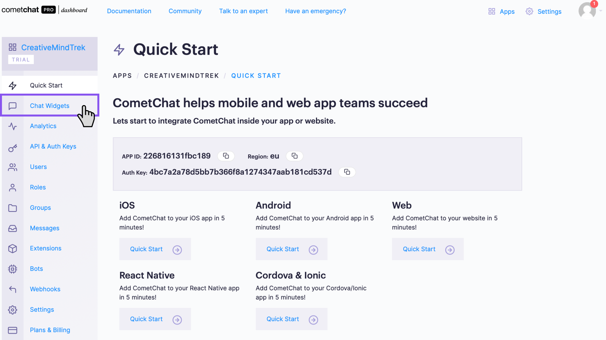
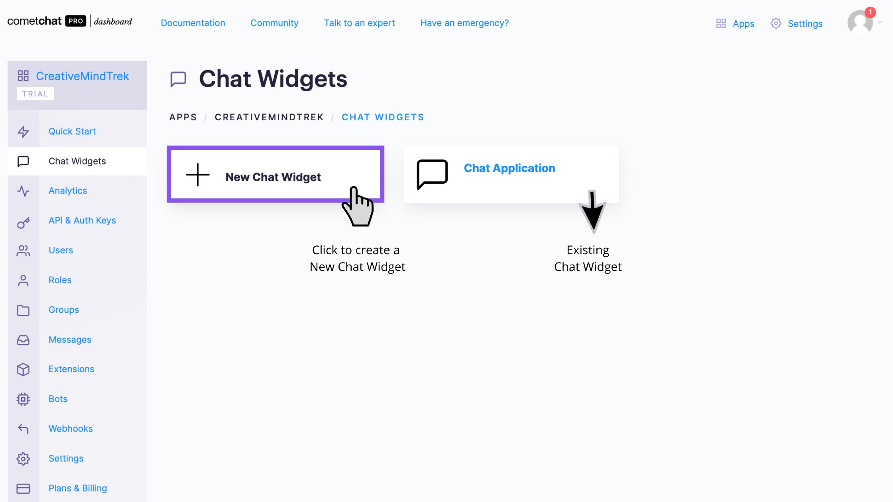
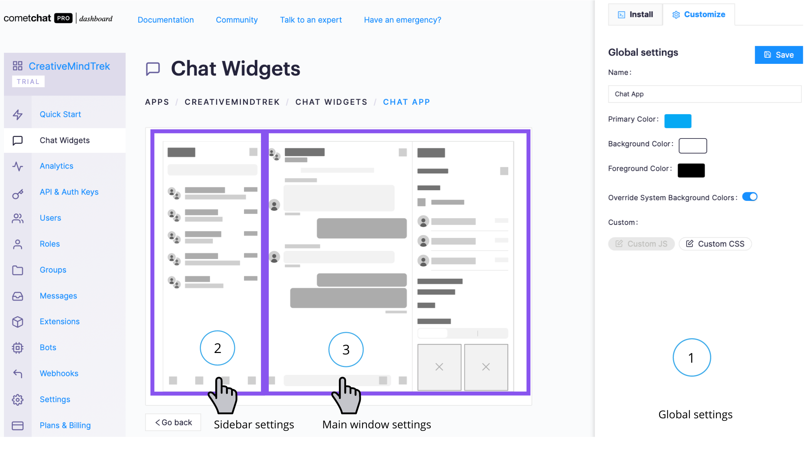
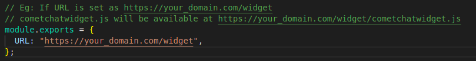

<div style="width:100%">
    <div style="width:50%;">
        <div align="center">
            
        </div>    
    </div>    
</div>

<br/><br/>

# Open-source Chat Widget Code for Advanced Customization

<p align="left">
  <a href="https://github.com/cometchat-pro/web-chat-widget-custom/releases/" alt="Releases">
    
  </a>
  <a href="https://twitter.com/CometChat">
    
  </a>
</p>

</br>

The Chat Widget simplifies the process of integrating a Chat on your website or mobile apps.
As a developer, you only need to toggle the widget's settings from our Dashboard and customize it to fit your needs. Within a few minutes, you can get started with our Chat widget.

---
## Features
- Private(1-1) & Group Conversations
- Voice & video calling & conferencing
- Rich Media Attachments
- Typing Indicators
- Text, Media and Custom messages
- Read receipts
- Online Presence Indicators
- Message History
- Users & Friends List
- Search by users and groups
- Groups List
- Conversations List
- Threaded Conversations

## Extensions

 [Thumbnail Generation](https://prodocs.cometchat.com/docs/extensions-thumbnail-generation) | [Link Preview](https://prodocs.cometchat.com/docs/extensions-link-preview) | [Rich Media Preview](https://prodocs.cometchat.com/docs/extensions-rich-media-preview) | [Smart Reply](https://prodocs.cometchat.com/docs/extensions-smart-reply)| [Emojis](https://prodocs.cometchat.com/docs/extensions-emojis) | [Polls](https://prodocs.cometchat.com/docs/extensions-polls) | [Reactions](https://prodocs.cometchat.com/docs/extensions-reactions) | [Stickers](https://prodocs.cometchat.com/docs/extensions-stickers)

  ---

## Prerequisites


- Register on [CometChat Dashboard](https://app.cometchat.com/signup)

- Create an app on the dashboard

- Click on the Chat Widget tab in the left navigation pane.

<br/>

- You will be redirected to the Chat Widget's main page.  You can create new widgets as well as see a list of your existing Chat widgets here.

<br/>


## Features of Chat Widget 

You can customize your chat widget under the chat widget section on dashboard.
Chat widget settings allow you to control the UI/UX aspect of the Chat Widget.

These setting can be broadly categorized as:
1. **Global Settings** - Here you will get the details about Installation of your Chat Widget.
2. **Sidebar Settings** - These will allow you to customize the layout of Sidebar.
3. **Main Window Settings** - These will control the UI/UX of the main Conversations window.

<br/>

## Installation Steps

1. **Clone this repository**

```javascript
  git clone https://github.com/cometchat-pro/web-chat-widget-custom
```

2. **Navigate to the CometChatWorkspace directory and replace the URL with your website URL in the CONSTS.js file**




3. **Build the project using the below command**

```javascript
  npm run build:custom
```

4. **Copy all the files from the build directory to your website source code**


# Troubleshooting

- To read the full documentation on Chat Widget visit our [Documentation](https://prodocs.cometchat.com/docs/chat-widget).

- Facing any issues while integrating or installing the Chat Widget please connect with us via real time support present in <a href="https://app.cometchat.com/" target="_blank">CometChat Dashboard.</a>

---

# Contributors

Thanks to the following people who have contributed to this project:

[👨‍💻 @priyadarshininadar](https://github.com/priyadarshininadar) <br>
[👨‍💻 @ajaygajra](https://github.com/ajaygajra) <br>
[👨‍💻 @prathamesh-majgaonkar](https://github.com/prathamesh-majgaonkar) <br>
[👨‍💻 @mayur-bhandari](https://github.com/mayur-bhandari)


---

# Contact

Contact us via real time support present in [CometChat Dashboard](https://app.cometchat.com/).

---

# License

---

This project uses the following [license](https://github.com/cometchat-pro/web-chat-widget-custom/blob/master/LICENSE).